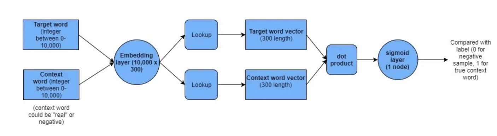
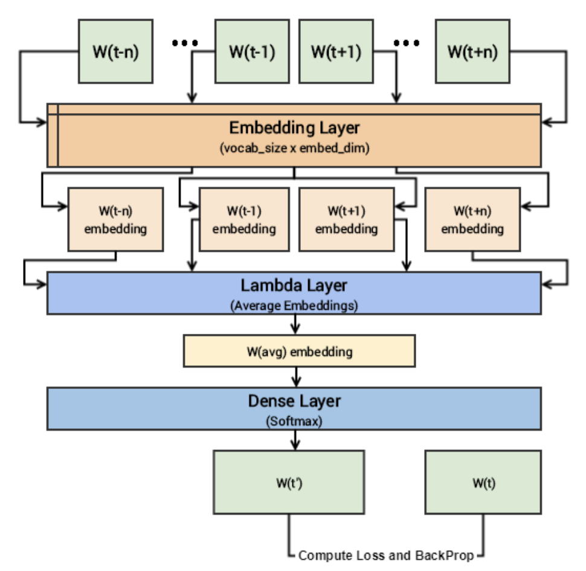

# Hcpcs2Vec

This project uses the skip-gram model to learn meaningful, dense embeddings for HCPCS procedure codes using big Medicare data.

## Inspiration

HCPCS procedure codes are used by medical professionals, billing companies, and insurance companies to document specific services provided to patients.

Procedure codes have proven to be valuable for a variety of analytics and machine learning projects, e.g. predicting readmission rates, predicting insurance fraud, or summarizing medical documents.

Representing these procedures using a traditional one-hot encoding results in very high-dimensional sparse vectors, i.e. > 50K dimensions. These large representations increase the computational complexity of machine learning algorithms and add to the curse of dimensionality. Furthermore, the one-hot representation fails to encode the meaningful relationships that exist between various procedure codes. Instead, all pairs of procedure codes are equidistant.

We can leverage the advances in NLP and word embeddings to construct low-rank continuous reprsentations of HCPCS codes that capture semantic meaning.

This project uses Word2Vec models to learn distributed representations of HCPCS procedure codes. Original Word2Vec paper - [Distributed Representations of Words and Phrases and their Compositionality, Mikolov et al.](https://arxiv.org/pdf/1310.4546.pdf)

## Skip-Gram

Similar to NLP word embeddings with skip-gram, this project uses skip-gram to predict context HCPCS procedures that co-occur with a target HCPCS code.

The skip-gram model is a neural network (NN) whose architecture is defined by the cardinality of the input (vocab size) and the dimensionality of the desired embedding. The target word is provided to the NN as a one-hot vector and a softmax output layer is used to predict the probability of observing each word in the vocab. Once training has converged, the hidden layer is used to extract the learned embeddings.

To overcome the complexity of a very large softmax output layer, negative sampling only updates the weights for a sample of the non-contextual (negative) procedure codes.



The model is fed two HCPCS procedure codes at a time with a label of 1 if they exist in context and 0 if they do not. Their embeddings are looked up, and their dot product is taken to compute their similarity. Finally, the similarity is fed to a binary logit output to predict whether or not they exist in context.

## Continuous Bag of Words (CBOW)

We also learn HCPCS embeddings using the CBOW Wmodel. The CBOW model architecture is similar to the skip-gram architecture. Unlike skip-gram, however, CBOW is optimized by trying to predict the current target word based on the current context, i.e. surrounding words.

The CBOW model also uses a NN architecture. A single input Xi is a set of context words derived from the corpus using a window size hyperparameter. The first layer, the Embedding layer, maps input tokens to their respective embeddings. The second layer aggregates the context embeddings by taking their average. Finally, a softmax layer is used to predict the center target token given the average context.



## Medicare Data

The Medicare data used in this project can be downloaded from the [cms.gov download page](https://www.cms.gov/Research-Statistics-Data-and-Systems/Statistics-Trends-and-Reports/Medicare-Provider-Charge-Data/Physician-and-Other-Supplier).

The utililty functions for loading Medicare data expect the data to be stored in the following format:

```
+-- 2012
|   +-- Medicare_Provider_Utilization_and_Payment_Data__Physician_and_Other_Supplier_CY2012.csv.gz
+-- 2013
|   +-- Medicare_Provider_Utilization_and_Payment_Data__Physician_and_Other_Supplier_CY2013.csv.gz
...................
...................
...................
+-- 2017
|   +-- Medicare_Provider_Utilization_and_Payment_Data__Physician_and_Other_Supplier_CY2017.csv.gz
```
